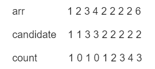
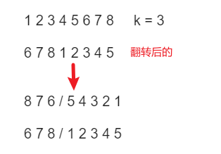

<!-- markdownlint-disable-file -->


## 1. 多数元素

力扣链接： [多数元素](https://leetcode.cn/problems/majority-element/description)

### 题目描述
给定一个大小为 n 的数组 nums ，返回其中的多数元素。多数元素是指在数组中出现次数 大于 ⌊ n/2 ⌋ 的元素。

你可以假设数组是非空的，并且给定的数组总是存在多数元素。


### 解题思路
1. 哈希表，元素为key，出现的次数为value，最后把value 大于n/2的元素返回 O(n) 
2. 排序，不论目标元素target为多少，排序后数组的中间值一定是target，因为target的数量> n/2 复杂度由算法决定
3. 摩尔投票  时间复杂度O(n)，空间复杂度O(1)


#### 摩尔投票法
摩尔投票算法（Moore's Voting Algorithm）是一种用于在数组中查找出现次数**超过一半**的主要元素的算法。该算法的核心思想是利用主要元素的出现次数超过一半的特性，通过**消除不同元素**之间的抵消，最终找到主要元素。

摩尔投票算法的步骤如下：

初始化候选主要元素 `candidate` 和计数器 `count`，将 `count` 设为 0。
遍历数组，对于每个元素 num：

* 如果`count` 为 0，将 `num` 设为候选主要元素，并且将 `count` 设为 1。
* 如果 `num` 等于候选主要元素 `candidate`，将 `count++` 。
* 如果 `num` 不等于候选主要元素 `candidate`，将 `count--` 。
* 遍历完成后，候选主要元素 `candidate` 即为最终的主要元素。
* 最后，可以再进行一次遍历验证候选主要元素出现的次数是否超过了一半。

这里的候选主要元素，只是候选，至于有没有选上，要看最后的`count`，所有不是主要元素的候选元素都会在遍历过程中被抵消



### Code
```C++ []
class Solution {
public:
    int majorityElement(vector<int>& nums) {
        //vote 就是的票数 count  x就是candidate
        int votes = 0; int x= nums[0];
        for(int i = 0 ; i < nums.size() ; i ++){
            //如果票数小于0 说明x被抵消了，重新选一个candidate
            if(votes <=0) x= nums[i];

            //如果票数大于0 说明x是当前的candidate
            //如果值相等 票数加一
            //如果值不相等 票数减一
            if(nums[i] == x ) votes ++;
            else votes --;
        } 
        return x;
   }
};
```


## 2.买卖股票的最佳时机

力扣链接： [买卖股票的最佳时机](https://leetcode.cn/problems/best-time-to-buy-and-sell-stock/solutions/1692872/by-jyd-cu90/)

### 题目描述
给定一个数组 prices ，它的第 i 个元素 prices[i] 表示一支给定股票第 i 天的价格。

你只能选择 某一天 买入这只股票，并选择在 未来的某一个不同的日子 卖出该股票。设计一个算法来计算你所能获取的最大利润。

返回你可以从这笔交易中获取的最大利润。如果你不能获取任何利润，返回 0 。


### 解题思路
1. 暴力枚举，遍历所有可能的买入和卖出日期，计算出最大利润  时间复杂度：O(n^2)
2. 贪心，只记录当前的最小买入值`cost`，然后计算当前值与`cost`的差值，更新最大利润`profit`   时间复杂度：O(n) 空间复杂度O(1)


### Code
```c++ []
class Solution {
public:
    int maxProfit(vector<int>& prices) {
        //默认最小买入值是数组的第一个元素 ，利益为0
        int cost=prices[0] ,p = 0;
        //特判一下，数据为1直接返回
        if(prices.size()==1) return 0;

        //遍历数组，更新最小买入值和最大利润
        for(int price :prices){
             //如果当前值小于最小买入值，更新最小买入值
            cost = min(cost,price);
             //如果当前值大于最小买入值，计算当前值与最小买入值的差值，更新最大利润
            p = max(p,price-cost);
        }
        return p;
    }
};
```


## 3.轮转数组

力扣链接： [轮转数组](https://leetcode.cn/problems/rotate-array/description/)

### 题目描述
给你一个数组，将数组中的元素向右轮转 k 个位置，其中 k 是非负数。


### 解题思路
1. 暴力枚举，每次移动一个位置，时间复杂度：O(n*k) 空间复杂度O(1)
2. 环状替换，没看
3. 翻转数组， 首先将数组整体翻转，然后将前k个翻转 ，再将剩余元素翻转。

#### 翻转数组
翻转后的元素，实际上就是把后k位元素 挪到了前k位，其余元素后移。
1. 整体翻转，将后k移到前边，但顺序不对
2. 前k个元素翻转，使前k个元素有序
3. 剩余元素翻转，使后k个元素有序




### Code
```c++ []
class Solution {
public:

 void reverse(vector<int>& nums,int begin,int end){
        while(begin<end){
            swap(nums[begin],nums[end]);
            begin++;end--;
        }
    }
    void rotate(vector<int>& nums, int k) {
        int l = nums.size();
        int k1 = k % l;
        reverse(nums,0,l-1);
        reverse(nums,0,k1-1);
        reverse(nums,k1,l-1);
    }

   
};
```

