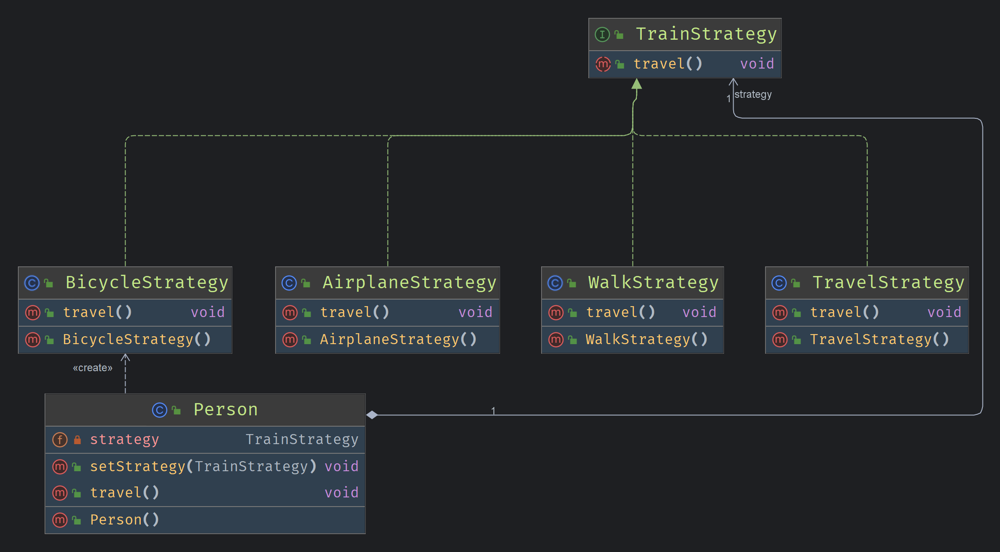

<!-- markdownlint-disable-file -->

# 策略模式

又叫策略模式 是一种对象行为型模式
当一个问题，有多种解决方法时，通常需要使用多个if-else选择某个具体的解决方法，此时可以使用策略模式
### 模式动机

实现某个目标的途径不止一条，可根据实际情况选择一种合适的途径

### 优点

- 提供了对**开闭原则**的完美支持，用户可以在不修改原有系统的基础上选择算法或行为，也可以新增行为
- 提供了**管理相关算法族**的办法
- 提供了一种可以**替换继承**关系的办法
- 可避免多重条件选择语句

### 缺点

- 客户端必须知道**所有**的策略类，并自行决定
- 无法同时使用**多个**策略类

### 实现


案例背景：
在介绍策略模式时，我们讲到了从不同角度出发，可以使用不同的出行策略的例子，如出行放式，可以选择飞机，步行，自行车，火车

Strategy 抽象类

```java
//规定统一的访问方式
public interface TrainStrategy {
    void travel();
}
```
Strategy 实现类

```java
public class BicycleStrategy implements TrainStrategy{
  
    @Override
    public void travel() {
        /*执行不同的算法*/
        System.out.println("Travel by bicycle");
    }
}

public class AirplaneStrategy implements TrainStrategy {
    @Override
    public void travel() {
        System.out.println("Use airplane to travel.");
    }
}
```
要解决的问题

```java
public class Person {
    private TrainStrategy strategy = new BicycleStrategy();

    public void setStrategy(TrainStrategy strategy) {
        this.strategy = strategy;
    }
    public void travel(){
        strategy.travel();
    }
}

```
主类

```java
public class Main {
    public static void main(String[] args) {
        Person person = new Person();
        //设置使用的策略，默认使用自行车
        person.setStrategy(XmlUtils.read());
        person.travel();
    }
}
```

